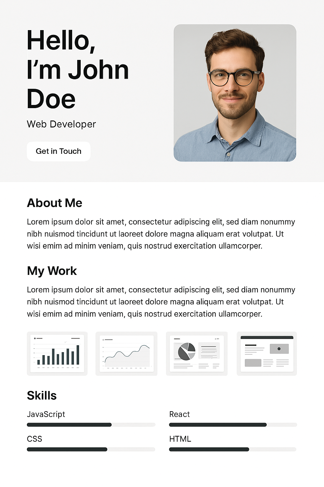
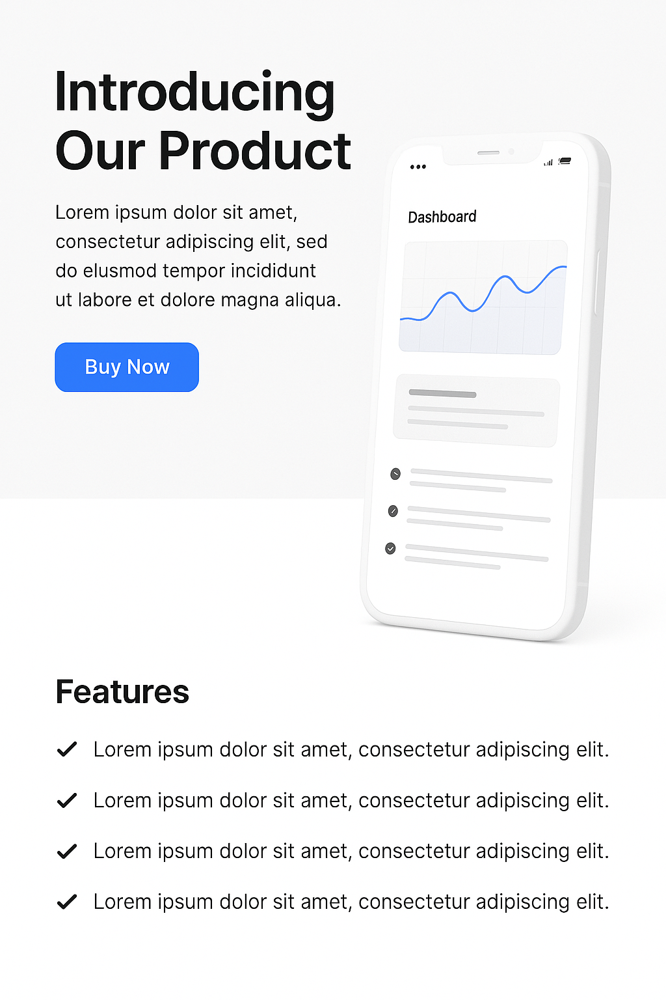

# [Angular](../../) > 🧑‍💻 Exercise 01

For learners who have completed [HTML5](../../html5/), [CSS3](../../css3/), and [JavaScript](../../javascript/)

---

## 1. Create a Personal Portfolio Page

Design a static page with your name, profile picture, a short bio, and links to your GitHub, LinkedIn, and Twitter.

### 🎯 Requirements:
- Profile image
- Bio/about me section
- Skills list

### 🔲 Sample UI



```html
<div style="border:1px solid #ccc; padding:10px; width:250px;">
  
  <h2>Hello World</h2>
  <p>Frontend Developer | JavaScript Enthusiast</p>
  <div>
    <a href="#">GitHub</a> | <a href="#">LinkedIn</a>
  </div>
</div>
```

---

## 2. Build a Product Landing Page

Create a static landing page for a product with title, description, image, features, and a CTA button.

### 🎯 Requirements:
- Product title and image
- Feature list
- Price and "Buy Now" button

### 🔲 Sample UI Thumbnail



```html
<div style="border:1px solid #ccc; padding:10px; width:250px;">
  
  <h2>Smart Gadget</h2>
  <p>Next-gen AI wearable</p>
  <button>Buy Now - $199</button>
</div>
```

---

## 3. Design a Blog Homepage

Design a homepage that displays a list of blog titles with a brief summary.

### 🎯 Requirements:
- Blog list layout
- Author name and date
- Clickable titles (non-functional)

### 🔲 Sample UI Thumbnail (HTML)

```html
<div style="border:1px solid #ccc; padding:10px; width:250px;">
  <h3>Understanding CSS Grid</h3>
  <small>By VVSK | Mar 2025</small>
  <p>A quick guide to mastering layout systems in CSS.</p>
</div>
```

---

## 4. User Registration Form

Design a form to collect user data including email, phone, and password with basic validation.

### 🎯 Requirements:
- Input fields (Name, Email, Phone, Password)
- Basic JS validation
- Submit button

### 🔲 Sample UI Thumbnail (HTML)

```html
<div style="border:1px solid #ccc; padding:10px; width:250px;">
  <h3>Register</h3>
  <input type="text" placeholder="Name"><br><br>
  <input type="email" placeholder="Email"><br><br>
  <input type="password" placeholder="Password"><br><br>
  <button>Submit</button>
</div>
```

---

## 5. Restaurant Menu Page

Create a menu page with categories like Starters, Mains, and Desserts, each with items and prices.

### 🎯 Requirements:
- Menu sections
- Images for dishes
- Prices

### 🔲 Sample UI Thumbnail (HTML)

```html
<div style="border:1px solid #ccc; padding:10px; width:250px;">
  <h3>🍕 Margherita Pizza</h3>
  <p>Classic Italian pizza with mozzarella</p>
  <strong>₹299</strong>
</div>
```

---

## 6. Travel Agency Home Page

Build a simple travel site showing destination cards and a basic contact form.

### 🎯 Requirements:
- Destination cards
- Contact/Inquiry form
- CTA buttons

### 🔲 Sample UI Thumbnail (HTML)

```html
<div style="border:1px solid #ccc; padding:10px; width:250px;">
  
  <h3>Visit Paris</h3>
  <p>5 Nights, 6 Days</p>
  <button>Book Now</button>
</div>
```

---
