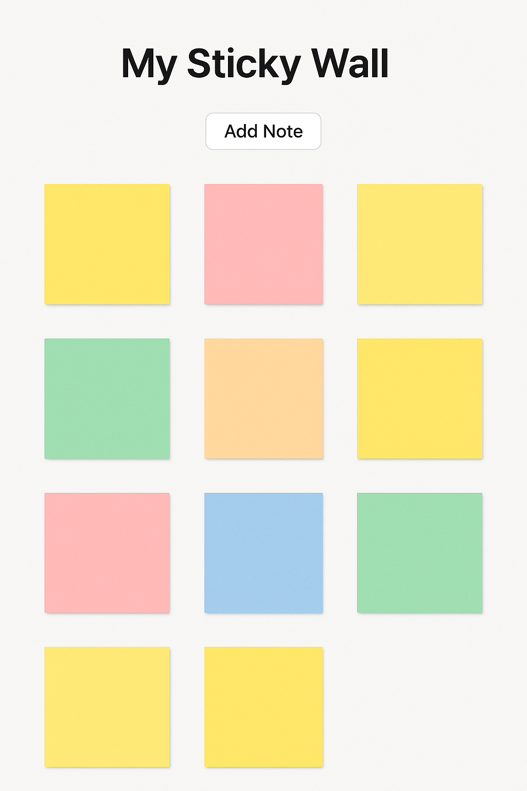

# [Angular](../) > 🧑‍💻 Exercise 01

For learners who have completed Bootstrap 5, JQuery, Responsive Design

---

# My Sticky Wall

A simple and intuitive web application where users can create, view, and manage virtual sticky notes. Ideal for organizing thoughts, ideas, and tasks in a colorful, draggable interface.

## 🧩 Features

- 📝 Add an unlimited number of sticky notes
- 🎨 Random pastel background color for each new note
- ✏️ Editable note content
- 🗑️ Delete notes
- 📌 Drag-and-drop positioning of notes on the wall
- 💾 Optional: Save state in local storage (to persist across page refresh)

### 🔲 Sample UI

🧪 Example Usage
Click the "Add Note" button to create a new sticky. Each note gets a random color and can be moved or edited directly.

---
