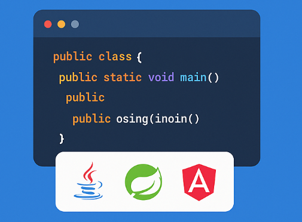

<html lang="en">
<head>
  <meta charset="UTF-8">
  <title>Fullstack Accelerator</title>
  <meta name="viewport" content="width=device-width, initial-scale=1.0">
  
</head>
<body>

  <section class="hero-banner">
    

      <h1 style="font-size:40px">
      
Master &nbsp;

      
Full-Stack &nbsp;

      
Development

      </h1>
      
Join our hands-on, project-based course to learn Java, Spring Boot & Angular from scratch. Designed for both students and professionals.

      <button class="cta-button" onclick="window.location.href='../'">Start Learning Now</button>
    

    

      
    

  </section>

  <section style="background-color: #f4f6f9; color: #0a2540; padding: 30px 10px">
  

    <h2 style="font-size: 2.5rem; margin-bottom: 20px;">About the Course</h2>
    

      The <b>Fullstack Accelerator</b> program is a complete roadmap to becoming a modern full-stack developer.
      It covers <strong>Java</strong>, <strong>Spring Boot</strong>, <strong>Angular</strong>, and integrates
      real-world application building at each step. Perfect for beginners and professionals aiming to upgrade.
    

    

    

        <h3 style="font-size: 1.2rem; color: #007bff;">From Theory to Code</h3>
        
Understand the basics, then put them into practice with hands-on projects. Start with the theory, end with real code – learning made practical.

      

      

        <h3 style="font-size: 1.2rem; color: #007bff;">Applied Learning</h3>
        
Transform your understanding of fullstack concepts into practical coding skills by applying theoretical knowledge directly to real-world projects.

      

      

        <h3 style="font-size: 1.2rem; color: #007bff;">Project based practice</h3>
        
Understand the logic behind the code, then bring it to life. This approach ensures you're not just memorizing concepts but applying them through meaningful.

      

      

        <h3 style="font-size: 1.2rem; color: #007bff;">Fullstack using AI</h3>
        
Learn how to leverage AI-powered tools to accelerate fullstack development tasks such as coding, testing, deployment.

      

      

        <h3 style="font-size: 1.2rem; color: #007bff;">Up-to-Date Content</h3>
        
Technology evolves rapidly, and so do we. This course is continuously updated to reflect the latest trends, tools, and best practices in fullstack development.

      

    

  

</section>
<section style="background-color: #ffffff; color: #0a2540; padding: 30px 10px">
  

    <h2 style="text-align: center; font-size: 2.5rem; margin-bottom: 40px;">What You'll Learn</h2>
    

      

        <h4 style="color: #007bff; margin-bottom: 10px;">Frontend Development</h4>
        <ul style="padding-left: 20px; color: #333;">
          <li>HTML5, CSS3, JavaScript</li>
          <li>JQuery & Boostrap</li>
          <li>Angular Framework</li>
          <li>Responsive Design</li>
          <li>Material Design</li>
        </ul>
      

      

        <h4 style="color: #007bff; margin-bottom: 10px;">Backend Development</h4>
        <ul style="padding-left: 20px; color: #333;">
          <li>Java Core & Advanced</li>
          <li>Spring Boot & REST APIs</li>
          <li>JPA & Hibernate</li>
          <li>Microservices</li>
        </ul>
      

      

        <h4 style="color: #007bff; margin-bottom: 10px;">Deployment & Tools</h4>
        <ul style="padding-left: 20px; color: #333;">
          <li>Git & GitHub</li>
          <li>Maven & Gradle</li>
          <li>Firebase Hosting</li>
        </ul>
      

    

  

</section>

<section style="background-color: #f4f6f9; color: #0a2540; padding: 40px 10px">
  

    <h2 style="ffont-size:40px; margin-bottom: 20px;">
    Not Convinced?
    </h2>
    
Help us understand your interests and goals in fullstack development.

    <a href="/survey" style="display: inline-block; padding: 14px 28px; font-size: 1rem; color: white; background-color: #007bff; border: none; border-radius: 6px; cursor: pointer; text-decoration: none; transition: background-color 0.3s ease;">Take Quick Survey</a>
  

</section>

</body>
</html>
