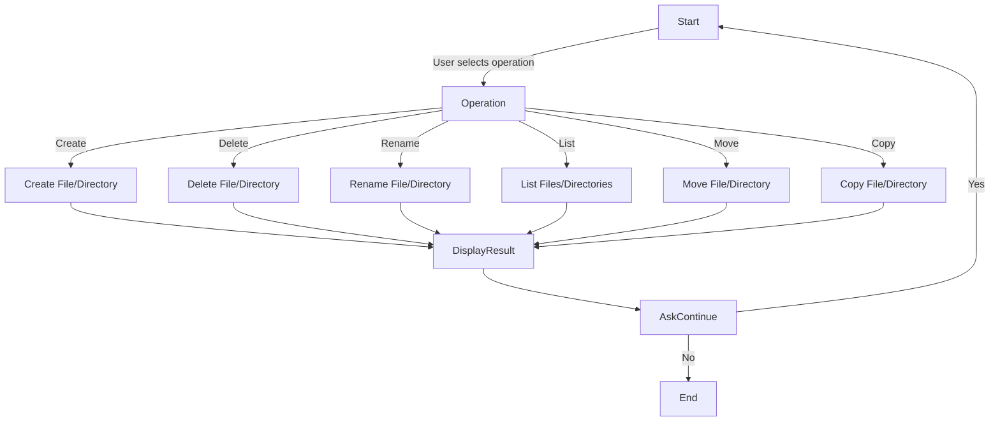

# File Manager - Requirements Document

## 1. Introduction
The File Manager is a console-based application that allows users to manage files and directories. Users can perform operations such as creating, deleting, renaming, and listing files and folders.

## 2. Functional Requirements
- **User Inputs**:
  - Command selection (create, delete, rename, list, move, copy).
  - File or directory name.
  - Destination path (if applicable).
- **Operations Supported**:
  - Create a file or directory.
  - Delete a file or directory.
  - Rename a file or directory.
  - List files and directories in a specified path.
  - Move a file or directory to a new location.
  - Copy a file or directory.
- **Output**:
  - Confirmation messages for operations.
  - Display of directory contents.

## 3. Non-Functional Requirements
- **Error Handling**:
  - Handle invalid file names and paths.
  - Prevent accidental deletion of system-critical files.
  - Validate user input.
- **User Interface**:
  - Simple text-based menu.
  - Clear prompts and messages.
- **Performance**:
  - Efficient file operations.
  - Minimal memory usage.

## 4. Integrating Mermaid with GitHub Pages
To enable Mermaid diagrams on GitHub Pages, add the following script to your Markdown file or include it in your repository:

## 5. Flowchart

