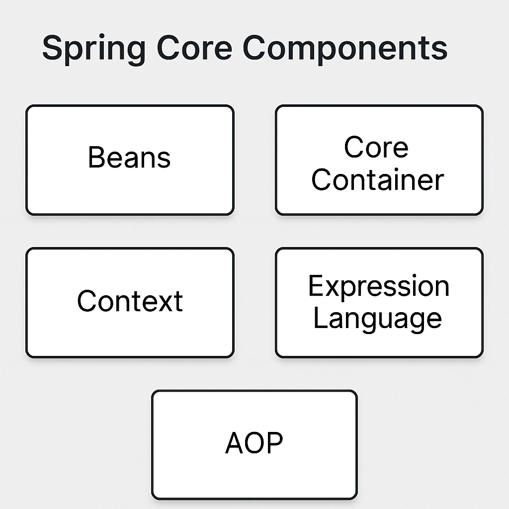

# [Spring](../) > Architecture

## Overview
Spring follows a layered architecture, making it flexible and modular. It provides different modules for various functionalities, such as dependency injection, web applications, security, and data access.

## Key Layers
Spring is structured into multiple layers:

| Layer | Description |
|--------|-------------|
| **Spring Core** | Manages dependency injection and bean lifecycle. |
| **Spring Web** | Facilitates web applications and REST APIs. |
| **Spring Data** | Supports database operations and ORM. |
| **Spring Messaging** | Provides integration with messaging systems like JMS and Kafka. |
| **Spring Security** | Provides authentication and authorization. |
| **Spring AOP (Aspect-Oriented Programming)** | Handles cross-cutting concerns like logging and security. |

## Spring Core 

Spring Core is the heart of the Spring Framework. It provides key functionalities such as bean management and dependency injection.



### 1. BeanFactory
- The simplest Spring container that creates and manages beans.
- Uses an XML configuration or Java-based configuration to define beans.

### 2. ApplicationContext
- An enhanced version of BeanFactory with additional features.
- Supports event handling, internationalization, and AOP.
- Common implementations:
  - `ClassPathXmlApplicationContext`
  - `AnnotationConfigApplicationContext`

### 3. Spring Beans
- The objects that Spring manages in its container.
- Defined using `@Component` and `@Bean` annotations.
- Example:
  ```java
  @Component
  public class MyBean {
      public void show() {
          System.out.println("Hello, Spring Bean!");
      }
  }
  ```

### 4. Dependency Injection (DI)
- A way for Spring to provide required dependencies automatically.
- Types:
  - **Constructor Injection**
  - **Field Injection** (`@Autowired` annotation)

### 5. Spring Expression Language (SpEL)
- Used to retrieve values dynamically within Spring.
- Example:
  ```java
  @Value("#{systemProperties['user.name']}")
  private String userName;
  ```

### 6. Event Handling
- Enables different parts of an application to communicate.
- Example:
  ```java
  public class MyEvent extends ApplicationEvent {
      public MyEvent(Object source) {
          super(source);
      }
  }
  ```

### 7. Resource Management
- Simplifies access to files and resources.
- Example:
  ```java
  Resource resource = new ClassPathResource("config.properties");
  ```

## Conclusion
Spring’s layered architecture makes it flexible, modular, and easy to use for various application types, from monolithic enterprise systems to cloud-native microservices.

---

[← Spring Introduction](../introduction) | [Spring Core →](../spring-core)

---

🔗 **Related Topics:**
- [Spring Core](../spring-core)
- [Spring Boot](../boot)
- [Spring MVC](../mvc)
- [Spring Security](../security)
- [Spring Cloud](../cloud)

---
